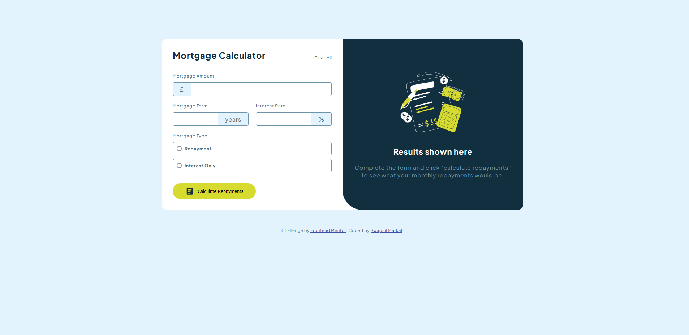

# Frontend Mentor - Mortgage repayment calculator solution

This is a solution to the [Mortgage repayment calculator challenge on Frontend Mentor](https://www.frontendmentor.io/challenges/mortgage-repayment-calculator-Galx1LXK73). Frontend Mentor challenges help you improve your coding skills by building realistic projects. 

## Table of contents

- [Overview](#overview)
  - [The challenge](#the-challenge)
  - [Screenshot](#screenshot)
  - [Links](#links)
- [My process](#my-process)
  - [Built with](#built-with)
  - [What I learned](#what-i-learned)
  - [Continued development](#continued-development)
  - [Useful resources](#useful-resources)
- [Author](#author)

## Overview

### The challenge

Users should be able to:

- Input mortgage information and see monthly repayment and total repayment amounts after submitting the form
- See form validation messages if any field is incomplete
- Complete the form only using their keyboard
- View the optimal layout for the interface depending on their device's screen size
- See hover and focus states for all interactive elements on the page

### Screenshot

### Links

- Solution URL: [Github Code](https://github.com/Cjmax10/mortgage-repayment-calculator)
- Live Site URL: [Live Site](https://cjmax10.github.io/mortgage-repayment-calculator/)

## My process

### Built with

- Semantic HTML5 markup
- CSS custom properties
- Flexbox
- CSS Grid
- DOM Manipulation

### What I learned

DOM Manipulation and Code Refracting

### Continued development

Many codes are still being repeated which can be further refracted.

### Useful resources

- [ChatGPT](https://openai.com/index/chatgpt/) - ChatGPT for formulaes
- [W3Schools](https://www.w3schools.com/) - DOM Manipulation

## Author

- Website - [Swapnil Markal](https://cjmax10.github.io/Portfolio/)
- Frontend Mentor - [@Cjmax10](https://www.frontendmentor.io/profile/Cjmax10)

**Note: Delete this note and add/remove/edit lines above based on what links you'd like to share.**